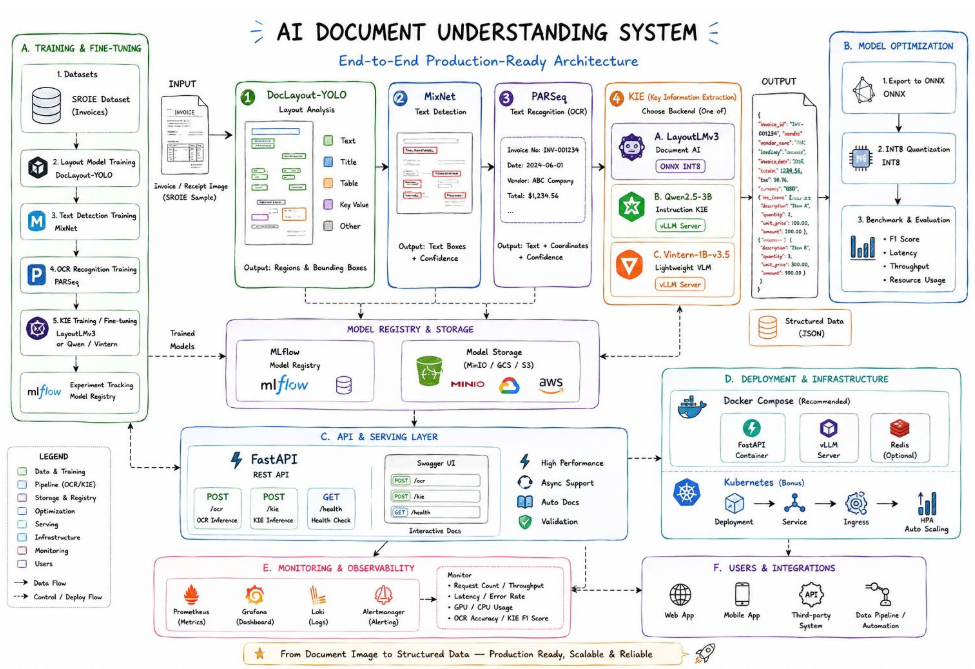

<div align="center">

# DocIntel — Production-Grade Document AI

**Turn invoice / receipt images into validated, structured, queryable JSON — served on CPU and fully observable.**


</div>

---

## Overview

DocIntel ingests a document image and returns clean, schema-validated JSON describing the receipt (line items, subtotal, tax, total, currency, per-field confidence, validation flags). It is built as a **modular, typed, tested, reproducible system** — composable services with clean interfaces, an MLflow-driven model lifecycle, and a full metrics-and-logs observability stack.

This repository is an **AI-engineering portfolio project**: the emphasis is on the end-to-end lifecycle and engineering quality — data → fine-tuning → optimization → serving → MLOps → observability — rather than chasing a single accuracy number or running a hosted service.

## Status

The **core MLOps spine (Phases 0–5) is complete and verified**. The advanced features (layout detection, GraphRAG `/ask`, LangGraph agent, Kubernetes, on-demand LLM KIE) are designed but not yet implemented. See **[`docs/phases/README.md`](docs/phases/README.md)** for the per-phase status and reports.

| Phase | Title | Status |
|---|---|---|
| 0 | Foundations & environment | ✅ |
| 1 | OCR baseline + `/extract` | ✅ |
| 2 | KIE fine-tune (LayoutLMv3) + MLflow | ✅ |
| 3 | Optimization: ONNX + INT8 + benchmark | ✅ |
| 4 | Serving + validation + schema + persistence | ✅ |
| 5 | Monitoring & observability | ✅ (CI image build/push deferred) |
| A1–A5 | Layout detection · GraphRAG · Agent · Kubernetes · LLM KIE | ⏳ planned |

## Pipeline Flow



A single `POST /extract` runs the full pipeline on CPU:

```
Image (PNG/JPG)
  → Preprocess (OpenCV, optional)
  → OCR (docTR)                          words + boxes + confidence
  → Key Information Extraction           LayoutLMv3, ONNX INT8 via onnxruntime
  → Decode                               BIO tokens → line items + scalar fields
  → Validation (Pydantic + rules)        reconciliation, required fields, confidence
  → Document (schema-validated JSON)
  → Persist                              metadata → SQLite, source image → MinIO
```

Validation **annotates, never blocks**: a receipt that fails reconciliation still returns `200` with `validation.ok = false` and the specific issues. Every extraction also records metrics (see Observability).

### API endpoints

| Method & path | Purpose |
|---|---|
| `POST /extract` | Run the pipeline on an uploaded image; returns a `Document` |
| `GET /documents/{id}` | Retrieve a previously extracted document |
| `GET /documents/{id}/image` | Retrieve the stored source image |
| `GET /health` | Liveness check |
| `GET /metrics` | Prometheus exposition (HTTP + custom KIE/validation metrics) |
| `GET /docs` | Interactive Swagger UI |

## Services & Hosts

`docker compose up` (from `docintel/`) brings up seven services. All ports are published to `localhost`:

| Service | Container | URL / port | Role |
|---|---|---|---|
| **API** | `docintel-api` | http://localhost:8000 ([`/docs`](http://localhost:8000/docs)) | FastAPI app — the pipeline + `/metrics` |
| **MLflow** | `docintel-mlflow` | http://localhost:5000 | Experiment tracking + model registry (serves model artifacts over HTTP) |
| **MinIO** | `docintel-minio` | http://localhost:9000 (S3) · http://localhost:9001 (console) | Object storage for source images (`minioadmin` / `minioadmin`) |
| **Prometheus** | `docintel-prometheus` | http://localhost:9090 | Scrapes the API `/metrics` every 15s; PromQL + `/targets` |
| **Loki** | `docintel-loki` | http://localhost:3100 | Log aggregation store (queried through Grafana) |
| **Promtail** | `docintel-promtail` | internal (`:9080`) | Tails all container stdout via the Docker socket → ships to Loki |
| **Grafana** | `docintel-grafana` | http://localhost:3000 | Dashboards over Prometheus + Loki (anonymous viewer; admin `admin` / `admin`) |

## Observability

Provisioned from in-repo files (`docintel/monitoring/`) so the stack boots fully wired — no manual setup.

**Metrics path:** the API is instrumented with `prometheus-fastapi-instrumentator` (standard HTTP request / latency / error metrics) plus two custom metrics bound to a per-app registry — `docintel_kie_field_confidence` (histogram) and `docintel_validation_total{outcome}` (counter), recorded on every `/extract`. Prometheus scrapes `api:8000/metrics`; Grafana visualizes it.

**Logs path:** Promtail discovers containers through the Docker socket and ships their stdout to Loki — **zero application code change**. Grafana's logs panel queries `{container="docintel-api"}`.

**Grafana → DocIntel dashboard** (6 panels): request rate · p95 latency · 5xx error rate · validation outcomes · KIE confidence heatmap · API logs.

## Getting Started

> Prerequisites: Docker + Docker Compose. All commands run from the `docintel/` directory.

```bash
cd docintel
cp .env.example .env
docker compose up -d --build      # first build is slow: torch + baked docTR weights
```

Open the dashboard at **http://localhost:3000 → DocIntel**, the API docs at **http://localhost:8000/docs**, and Prometheus targets at **http://localhost:9090/targets**.

Smoke test:

```bash
curl http://localhost:8000/health
curl -F "file=@receipt.png;type=image/png" http://localhost:8000/extract
curl http://localhost:8000/metrics | grep docintel_      # custom metrics
```

Tear down with `docker compose down` (add `-v` to wipe volumes).

### The KIE model

The fine-tuned ONNX-INT8 LayoutLMv3 model is too large for git and is kept **locally** (git-ignored) under `models/`. `/extract` obtains it one of two ways:

- **MLflow registry (default):** the API pulls `cord-layoutlmv3-onnx-int8` from MLflow over HTTP. If the registry is empty, register the local bundle first (see [`docs/phases/phase4`](docs/phases) / Phase 3 export).
- **Local path (no MLflow):** set `DOCINTEL_KIE_ONNX_LOCAL_PATH` to the local bundle directory (e.g. `models/cord-layoutlmv3-onnx-int8`) and the backend loads it straight from disk.

## Configuration

All settings use the `DOCINTEL_` env prefix (see `docintel/.env.example`). Notable keys:

| Variable | Default | Meaning |
|---|---|---|
| `DOCINTEL_MLFLOW_TRACKING_URI` | `http://mlflow:5000` | MLflow endpoint |
| `DOCINTEL_MINIO_ENDPOINT` | `minio:9000` | Object store endpoint |
| `DOCINTEL_KIE_ONNX_LOCAL_PATH` | _(unset)_ | If set, load the ONNX bundle from this dir instead of MLflow |
| `DOCINTEL_KIE_ONNX_MODEL_VERSION` | `1` | Registry version to pull |
| `DOCINTEL_VALIDATION_TOLERANCE` | `1.0` | Reconciliation tolerance |
| `DOCINTEL_CONFIDENCE_THRESHOLD` | `0.5` | Low-confidence warning threshold |
| `DOCINTEL_MAX_UPLOAD_MB` | `10` | Upload size limit |

## Tech Stack

| Layer | Technology |
|---|---|
| API & serving | Python 3.12, FastAPI, Uvicorn, Pydantic v2 |
| Vision / OCR | OpenCV, docTR |
| KIE | LayoutLMv3 (fine-tuned on CORD) |
| Inference runtime | ONNX Runtime (INT8) |
| MLOps & storage | MLflow, MinIO, DVC |
| Observability | Prometheus, Grafana, Loki, Promtail |
| Packaging | Docker, docker-compose |
| Tooling | uv, ruff, mypy (strict), pytest |

## Compute Model

Development and CPU inference run **locally**; GPU-bound work runs on **Google Colab Pro**:

- **Build-time (Colab, GPU):** training, fine-tuning, ONNX export, INT8 quantization, benchmarking.
- **Run-time (local, CPU):** the API, pipeline inference, and the full observability stack.

Models are trained on Colab, registered in MLflow, and pulled locally as optimized ONNX artifacts. Containers are included to demonstrate deployability; running a public always-on service is intentionally out of scope.

## Repository Structure

```
.
├── docintel/                 # The application + its stack
│   ├── src/docintel/         # pipeline, kie, api, validation, storage, optimize, config
│   ├── tests/                # unit & integration tests (pytest)
│   ├── monitoring/           # Prometheus / Loki / Promtail / Grafana config (provisioned)
│   ├── notebooks/            # Colab training / fine-tuning / benchmarking
│   ├── docker-compose.yml    # the 7-service stack
│   ├── Dockerfile            # CPU-only runtime image
│   └── pyproject.toml        # deps + extras (serve, kie, optimize, data, train, dev)
├── docs/                     # pipeline, plan, proposal, research, benchmark, phase reports
├── models/                   # local model bundles (git-ignored, kept off git)
└── CLAUDE.md                 # engineering standards for this repo
```

## Development

```bash
cd docintel
uv sync --all-extras          # full env (uv sync replaces the env; sync ALL extras for the test suite)
uv run ruff check . && uv run ruff format --check .
uv run mypy src
uv run pytest                 # one slow real-OCR test is deselected by default
```

## Documentation

| Document | Purpose |
|---|---|
| [`docs/pipeline.md`](docs/pipeline.md) | End-to-end reference architecture |
| [`docs/plan.md`](docs/plan.md) | Phased build roadmap |
| [`docs/proposal.md`](docs/proposal.md) | System design & tech-stack decisions |
| [`docs/research.md`](docs/research.md) | Environment, feasibility, datasets, scope |
| [`docs/benchmark.md`](docs/benchmark.md) | ONNX / INT8 accuracy · latency · size benchmark |
| [`docs/phases/README.md`](docs/phases/README.md) | Per-phase status and completion reports |

---

<div align="center">
<sub>A reference implementation built to demonstrate end-to-end, production-grade AI engineering.</sub>
</div>
