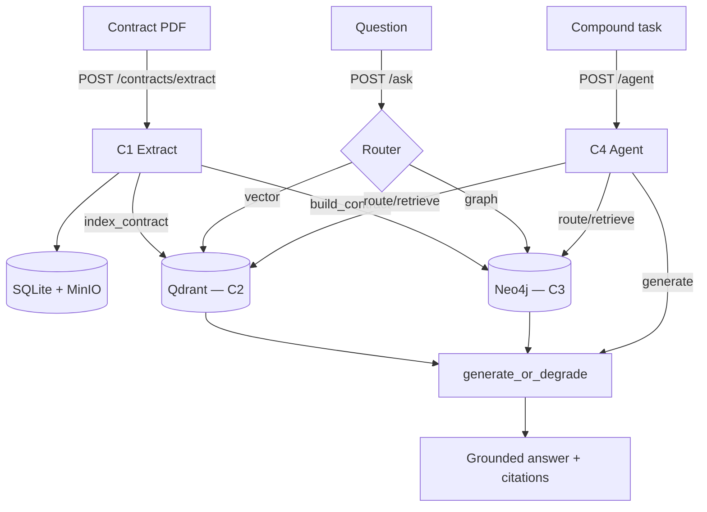

# Contract Intelligence Architecture (C1–C4)

DocIntel chains four stages into one contract-analysis platform. The FastAPI
service wires them together: extraction fans out into the retrieval stores, and
the query surfaces read from those stores.

## Stages

- **C1 — Extraction** (`docintel.contracts`, `POST /contracts/extract`): a PDF is
  ingested (digital text or OCR), a CUAD QA ONNX model extracts clause spans, and
  the result is persisted as a `ContractDocument`. In the same request the text +
  clauses are indexed into the vector store (C2) and normalized into the graph (C3),
  both best-effort — extraction still succeeds if a store is down.
- **C2 — RAG** (`docintel.rag`): clause-aware chunks are embedded
  (`bge-small-en-v1.5` via fastembed) into Qdrant; `POST /ask` retrieves top-k
  cited chunks and generates a grounded answer.
- **C3 — GraphRAG** (`docintel.graph`): contracts become a small subgraph in
  Neo4j; date/renewal questions are answered by Cypher templates. `POST /ask`
  routes graph-vs-vector via a rule-based router.
- **C4 — Agent** (`docintel.agent`, `POST /agent`): a LangGraph state machine
  (route → retrieve → generate → critique, one bounded retry) orchestrates the
  C1–C3 tools for compound tasks, with optional Langfuse tracing.

## Request / data flow



## Degradation matrix

| Surface | No LLM (`DOCINTEL_LLM_BASE_URL` unset) | No graph store | No vector store |
| --- | --- | --- | --- |
| `/contracts/extract` | unaffected (indexing/graph are best-effort) | extraction succeeds, no graph node | extraction succeeds, no chunks |
| `/ask` | `generation_skipped=true`, citations only | router falls back to vector | `503` |
| `/agent` | `status="degraded"`, citations only | retrieves via vector | degraded |

## Running the full stack

1. Start backing services (Qdrant, Neo4j, MinIO) via Compose under `docintel/infra`.
2. Provide the CUAD ONNX extractor (e.g. `DOCINTEL_KIE_ONNX_LOCAL_PATH`) and any
   graph settings (`DOCINTEL_GRAPH_ENABLED=true`).
3. (Optional, GPU) point at a self-hosted LLM for grounded answers:
   ```bash
   export DOCINTEL_LLM_BASE_URL="https://<host>/v1"
   export DOCINTEL_LLM_API_KEY="EMPTY"
   export DOCINTEL_LLM_MODEL="Qwen/Qwen2.5-7B-Instruct"
   ```
4. Run the API: `uvicorn docintel.api.main:app --reload`
5. Run the UI: `streamlit run src/docintel/ui/app.py`
6. Run the demo: `docintel-demo` (synthesizes a sample contract) or
   `docintel-demo --pdf your_contract.pdf`.

Only the LLM needs a GPU; C1 extraction, C2 embeddings, Qdrant, and Neo4j all run
on CPU.
