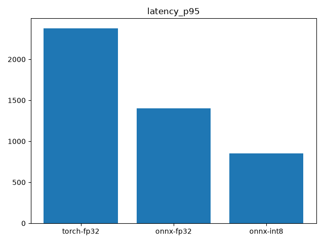
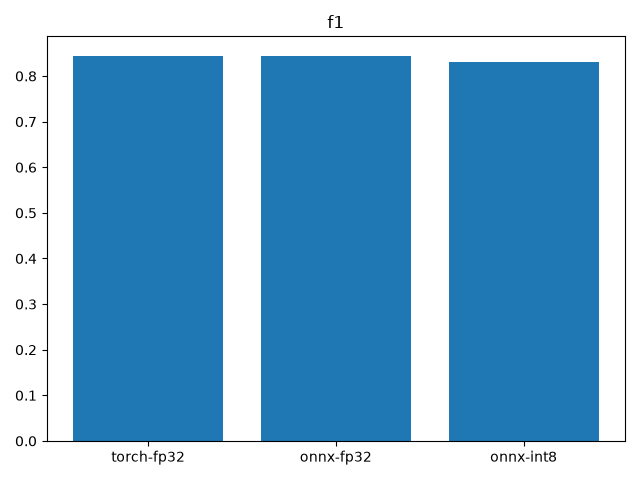
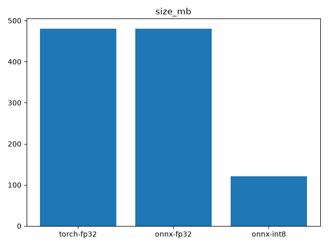

# DocIntel KIE Benchmark — LayoutLMv3 (fp32 vs ONNX vs INT8)

**Takeaway:** On laptop CPU, the served **ONNX INT8** model is **3.0× faster** (p50 1934 → 650 ms),
delivers **2.9× throughput**, and is **4× smaller** (480 → 121 MB) than the PyTorch fp32 baseline,
while retaining **98.4% of F1** (0.8449 → 0.8315, a 1.3-point drop). ONNX Runtime alone accounts for
~1.6× of the speedup; dynamic INT8 quantization adds a further ~1.9×. Evaluated on 50 CORD `test`
receipts (latency: 3 warmup runs discarded, 5 timed repeats).

| Config | F1 | Precision | Recall | Accuracy | p50 (ms) | p95 (ms) | Throughput (doc/s) | Size (MB) |
|---|---|---|---|---|---|---|---|---|
| torch-fp32 | 0.8449 | 0.8343 | 0.8557 | 0.8700 | 1934.2 | 2379.9 | 0.50 | 480.5 |
| onnx-fp32 | 0.8449 | 0.8343 | 0.8557 | 0.8700 | 1214.7 | 1401.4 | 0.78 | 480.8 |
| onnx-int8 | 0.8315 | 0.8177 | 0.8457 | 0.8651 | 650.2 | 852.0 | 1.46 | 121.4 |

