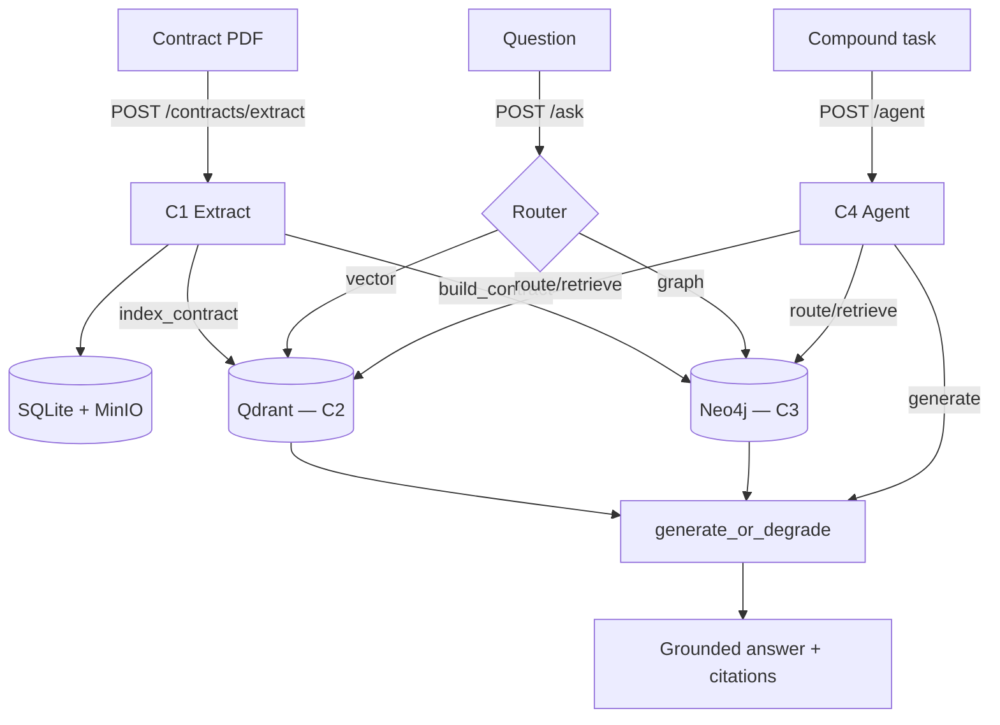

# Contract Platform Integration (C1–C4) Implementation Plan

> **For agentic workers:** REQUIRED SUB-SKILL: Use superpowers:subagent-driven-development (recommended) or superpowers:executing-plans to implement this plan task-by-task. Steps use checkbox (`- [ ]`) syntax for tracking.

**Goal:** Surface the already-wired C1–C4 contract pipeline through a contract-only Streamlit UI, lock the wiring with an in-process end-to-end test, add an HTTP demo script, and document the architecture.

**Architecture:** The FastAPI service already chains the stages (`/contracts/extract` auto-indexes into the RAG store and builds the graph; `/ask` routes graph-vs-vector; `/agent` orchestrates C1–C3). This work adds presentation + verification layers only — no business-logic changes. UI HTTP/formatting logic is isolated in a pure, unit-tested module; the Streamlit page stays presentation-only.

**Tech Stack:** Python 3.12, FastAPI, Streamlit, httpx, pytest, Qdrant (in-memory for tests), Neo4j/`InMemoryGraphStore`, LangGraph, pymupdf (`fitz`).

## Global Constraints

- Full type hints on every function; `mypy src` runs strict and must stay clean.
- `ruff check src tests` must stay clean (line-length 100).
- Prefer functional helpers over classes; keep functions small and focused.
- No hardcoded constants that belong in settings; reuse `docintel.config.Settings` (`DOCINTEL_` env prefix).
- No new `slow`-marked tests; new tests run CPU-only with fakes/in-memory stores.
- Do NOT modify the `/extract` receipt-KIE backend route or the KIE pipeline — only the UI drops receipts.
- Do NOT change C1–C4 business logic.
- No committed sample PDF binary; the demo synthesizes one with `fitz`.
- Env prefix for all settings is `DOCINTEL_`.

---

### Task 1: Contract UI client (pure HTTP + formatting helpers)

**Files:**
- Create: `src/docintel/ui/contract_client.py`
- Test: `tests/test_ui_contract_client.py`

**Interfaces:**
- Consumes: nothing (leaf module; `httpx` only).
- Produces:
  - `ContractApiError(Exception)`
  - `extract_contract(base_url: str, timeout_s: float, filename: str, data: bytes) -> dict[str, Any]`
  - `ask_question(base_url: str, timeout_s: float, question: str, contract_id: str | None) -> dict[str, Any]`
  - `run_agent(base_url: str, timeout_s: float, task: str, contract_id: str | None) -> dict[str, Any]`
  - `clause_rows(document: dict[str, Any]) -> list[dict[str, Any]]`
  - `citation_rows(response: dict[str, Any]) -> list[dict[str, Any]]`

- [ ] **Step 1: Write the failing test**

Create `tests/test_ui_contract_client.py`:

```python
"""Unit tests for the contract UI client helpers."""

from __future__ import annotations

import httpx
import pytest

from docintel.ui.contract_client import (
    ContractApiError,
    ask_question,
    citation_rows,
    clause_rows,
    extract_contract,
    run_agent,
)

_BASE_URL = "http://api:8000"


def _with_transport(transport: httpx.MockTransport, call):
    """Run `call` with httpx.post routed through a mock transport."""
    real_post = httpx.post

    def fake_post(url: str, **kwargs: object) -> httpx.Response:
        with httpx.Client(transport=transport) as client:
            return client.post(url, **kwargs)  # type: ignore[arg-type]

    httpx.post = fake_post  # type: ignore[assignment]
    try:
        return call()
    finally:
        httpx.post = real_post  # type: ignore[assignment]


def test_extract_contract_success() -> None:
    transport = httpx.MockTransport(lambda req: httpx.Response(200, json={"id": "c1"}))
    result = _with_transport(
        transport, lambda: extract_contract(_BASE_URL, 5.0, "c.pdf", b"%PDF")
    )
    assert result == {"id": "c1"}


def test_ask_question_sends_contract_id() -> None:
    seen: dict[str, object] = {}

    def handler(req: httpx.Request) -> httpx.Response:
        import json

        seen.update(json.loads(req.content))
        return httpx.Response(200, json={"answer": "NY"})

    transport = httpx.MockTransport(handler)
    result = _with_transport(
        transport, lambda: ask_question(_BASE_URL, 5.0, "law?", "c1")
    )
    assert result == {"answer": "NY"}
    assert seen == {"question": "law?", "contract_id": "c1"}


def test_ask_question_omits_empty_contract_id() -> None:
    seen: dict[str, object] = {}

    def handler(req: httpx.Request) -> httpx.Response:
        import json

        seen.update(json.loads(req.content))
        return httpx.Response(200, json={"answer": "NY"})

    _with_transport(
        httpx.MockTransport(handler), lambda: ask_question(_BASE_URL, 5.0, "law?", None)
    )
    assert "contract_id" not in seen


def test_run_agent_success() -> None:
    transport = httpx.MockTransport(lambda req: httpx.Response(200, json={"status": "ok"}))
    result = _with_transport(
        transport, lambda: run_agent(_BASE_URL, 5.0, "summarize", "c1")
    )
    assert result == {"status": "ok"}


def test_error_detail_and_status() -> None:
    transport = httpx.MockTransport(
        lambda req: httpx.Response(503, json={"detail": "Vector store unavailable."})
    )
    with pytest.raises(ContractApiError, match=r"503.*Vector store unavailable"):
        _with_transport(transport, lambda: ask_question(_BASE_URL, 5.0, "q", None))


def test_timeout_and_connection_errors() -> None:
    def raise_timeout(req: httpx.Request) -> httpx.Response:
        raise httpx.TimeoutException("slow", request=req)

    with pytest.raises(ContractApiError, match="timed out"):
        _with_transport(
            httpx.MockTransport(raise_timeout),
            lambda: extract_contract(_BASE_URL, 5.0, "c.pdf", b"%PDF"),
        )

    def raise_connect(req: httpx.Request) -> httpx.Response:
        raise httpx.ConnectError("refused", request=req)

    with pytest.raises(ContractApiError, match="Could not reach"):
        _with_transport(
            httpx.MockTransport(raise_connect),
            lambda: run_agent(_BASE_URL, 5.0, "t", None),
        )


def test_clause_rows_maps_fields_and_missing() -> None:
    document = {
        "clauses": [
            {"clause_type": "Parties", "answer_text": "Acme", "confidence": 0.9},
            {"clause_type": None, "answer_text": None, "confidence": None},
        ]
    }
    rows = clause_rows(document)
    assert rows[0] == {"Type": "Parties", "Text": "Acme", "Confidence": 0.9}
    assert rows[1] == {"Type": "—", "Text": "—", "Confidence": None}


def test_citation_rows_maps_fields() -> None:
    response = {
        "citations": [
            {"contract_id": "c1", "clause_type": "Governing Law", "score": 0.8, "text": "NY"}
        ]
    }
    rows = citation_rows(response)
    assert rows[0] == {"Contract": "c1", "Clause": "Governing Law", "Score": 0.8, "Text": "NY"}
```

- [ ] **Step 2: Run test to verify it fails**

Run: `.venv/Scripts/python.exe -m pytest tests/test_ui_contract_client.py -q`
Expected: FAIL with `ModuleNotFoundError: No module named 'docintel.ui.contract_client'`.

- [ ] **Step 3: Write minimal implementation**

Create `src/docintel/ui/contract_client.py`:

```python
"""Pure, testable helpers for the contract-intelligence Streamlit page.

HTTP access to ``/contracts/extract``, ``/ask``, ``/agent`` plus small
formatting helpers live here so they can be unit-tested; the page module keeps
only the thin Streamlit rendering layer (mirrors the receipt UI split this
replaces).
"""

from __future__ import annotations

from typing import Any, cast

import httpx

_PDF_TYPE = "application/pdf"


class ContractApiError(Exception):
    """Raised when a contract API request fails, carrying a user-facing message."""


def _error_detail(response: httpx.Response) -> str:
    """Pull a human-readable ``detail`` from an error response, falling back to text."""
    try:
        payload = response.json()
    except ValueError:
        return response.text or "no detail"
    if isinstance(payload, dict) and "detail" in payload:
        return str(payload["detail"])
    return str(payload)


def _post(url: str, timeout_s: float, **kwargs: Any) -> dict[str, Any]:
    """POST and return parsed JSON, mapping transport/HTTP errors to ContractApiError."""
    try:
        response = httpx.post(url, timeout=timeout_s, **kwargs)
    except httpx.TimeoutException as exc:
        raise ContractApiError("The API timed out while processing the request.") from exc
    except httpx.HTTPError as exc:
        raise ContractApiError(f"Could not reach the API at {url}.") from exc
    if response.is_success:
        return cast("dict[str, Any]", response.json())
    raise ContractApiError(f"Request failed ({response.status_code}): {_error_detail(response)}")


def extract_contract(
    base_url: str, timeout_s: float, filename: str, data: bytes
) -> dict[str, Any]:
    """POST a PDF to ``/contracts/extract`` and return the parsed ContractDocument JSON."""
    url = f"{base_url.rstrip('/')}/contracts/extract"
    return _post(url, timeout_s, files={"file": (filename, data, _PDF_TYPE)})


def ask_question(
    base_url: str, timeout_s: float, question: str, contract_id: str | None
) -> dict[str, Any]:
    """POST ``/ask`` (scoped to one contract when given) and return the AskResponse JSON."""
    payload: dict[str, Any] = {"question": question}
    if contract_id:
        payload["contract_id"] = contract_id
    return _post(f"{base_url.rstrip('/')}/ask", timeout_s, json=payload)


def run_agent(
    base_url: str, timeout_s: float, task: str, contract_id: str | None
) -> dict[str, Any]:
    """POST ``/agent`` (scoped to one contract when given) and return the AgentResponse JSON."""
    payload: dict[str, Any] = {"task": task}
    if contract_id:
        payload["contract_id"] = contract_id
    return _post(f"{base_url.rstrip('/')}/agent", timeout_s, json=payload)


def clause_rows(document: dict[str, Any]) -> list[dict[str, Any]]:
    """Flatten a ContractDocument's clauses into table rows."""
    rows: list[dict[str, Any]] = []
    for clause in document.get("clauses", []):
        rows.append(
            {
                "Type": clause.get("clause_type") or "—",
                "Text": clause.get("answer_text") or "—",
                "Confidence": clause.get("confidence"),
            }
        )
    return rows


def citation_rows(response: dict[str, Any]) -> list[dict[str, Any]]:
    """Flatten an Ask/Agent response's citations into table rows."""
    rows: list[dict[str, Any]] = []
    for chunk in response.get("citations", []):
        rows.append(
            {
                "Contract": chunk.get("contract_id") or "—",
                "Clause": chunk.get("clause_type") or "—",
                "Score": chunk.get("score"),
                "Text": chunk.get("text") or "—",
            }
        )
    return rows
```

- [ ] **Step 4: Run test to verify it passes**

Run: `.venv/Scripts/python.exe -m pytest tests/test_ui_contract_client.py -q`
Expected: PASS (9 tests).

- [ ] **Step 5: Lint and type-check**

Run: `.venv/Scripts/python.exe -m ruff check src/docintel/ui/contract_client.py tests/test_ui_contract_client.py && .venv/Scripts/python.exe -m mypy src/docintel/ui/contract_client.py`
Expected: clean.

- [ ] **Step 6: Commit**

```bash
git add src/docintel/ui/contract_client.py tests/test_ui_contract_client.py
git commit -m "feat(ui): add pure contract API client helpers"
```

---

### Task 2: Contract-only Streamlit page (remove receipt UI)

**Files:**
- Rewrite: `src/docintel/ui/app.py`
- Modify: `src/docintel/ui/__init__.py:1` (update docstring)
- Delete: `src/docintel/ui/client.py`
- Delete: `tests/test_ui_client.py`

**Interfaces:**
- Consumes: `docintel.ui.contract_client.{extract_contract, ask_question, run_agent, clause_rows, citation_rows, ContractApiError}`; `docintel.config.get_settings`.
- Produces: a runnable Streamlit page (`main() -> None`); no importable API relied on by other tasks.

> Streamlit rendering is not unit-tested (matches the existing arrangement — the suite never imports `app.py`). The gate for this task is ruff + mypy + the full suite still green after the receipt files are removed.

- [ ] **Step 1: Delete the receipt UI files**

```bash
git rm src/docintel/ui/client.py tests/test_ui_client.py
```

- [ ] **Step 2: Verify the suite still passes without the receipt files**

Run: `.venv/Scripts/python.exe -m pytest -q`
Expected: PASS (the previous receipt-client tests are gone; nothing else imports `ui.client`).

- [ ] **Step 3: Update the package docstring**

Edit `src/docintel/ui/__init__.py` — replace line 1 with:

```python
"""Streamlit UI layer: upload a contract and run extract / ask / agent."""
```

- [ ] **Step 4: Rewrite `app.py` as the contract page**

Replace the entire contents of `src/docintel/ui/app.py` with:

```python
"""Streamlit entrypoint: the Contract Intelligence page (C1–C4).

Run with ``streamlit run src/docintel/ui/app.py``. The API base URL and request
timeout come from :class:`docintel.config.Settings` (``DOCINTEL_`` env prefix).
Three tabs walk the pipeline: Extract (C1), Ask (C2/C3), Agent (C4). Each tab
calls the running API and renders its result; the API degrades gracefully to
citations-only when no LLM is configured, and this page just reflects that.
"""

from __future__ import annotations

from typing import Any, cast

import streamlit as st

from docintel.config import get_settings
from docintel.ui.contract_client import (
    ContractApiError,
    ask_question,
    citation_rows,
    clause_rows,
    extract_contract,
    run_agent,
)


def _scope_id() -> str | None:
    """Return the session's extracted contract id, if any."""
    return cast("str | None", st.session_state.get("contract_id"))


def _render_citations(response: dict[str, Any]) -> None:
    rows = citation_rows(response)
    if rows:
        st.subheader("Citations")
        st.dataframe(rows, use_container_width=True, hide_index=True)
    else:
        st.info("No citations returned.")


def _extract_tab(base_url: str, timeout_s: float) -> None:
    st.caption("Upload a contract PDF to extract structured clauses (C1).")
    uploaded = st.file_uploader("Contract PDF", type=["pdf"])
    if uploaded is None:
        return
    if st.button("Extract", key="extract_btn"):
        with st.spinner("Extracting…"):
            try:
                doc = extract_contract(base_url, timeout_s, uploaded.name, uploaded.getvalue())
            except ContractApiError as exc:
                st.error(str(exc))
                return
        st.session_state["contract_id"] = doc["id"]
        st.success(f"Extracted contract {doc['id']} (source: {doc['source']}).")
        rows = clause_rows(doc)
        if rows:
            st.dataframe(rows, use_container_width=True, hide_index=True)
        else:
            st.info("No clauses detected.")
        with st.expander("Derived fields"):
            st.json(doc.get("derived", {}))
        with st.expander("Raw JSON"):
            st.json(doc)


def _ask_tab(base_url: str, timeout_s: float) -> None:
    st.caption("Ask a question grounded in the indexed contracts (C2 vector / C3 graph).")
    question = st.text_input("Question", key="ask_q")
    scoped = st.checkbox("Only the last extracted contract", value=True, key="ask_scope")
    if st.button("Ask", key="ask_btn") and question:
        with st.spinner("Answering…"):
            try:
                resp = ask_question(
                    base_url, timeout_s, question, _scope_id() if scoped else None
                )
            except ContractApiError as exc:
                st.error(str(exc))
                return
        if resp.get("generation_skipped"):
            st.warning("Generation skipped (no LLM configured) — showing citations only.")
        elif resp.get("answer"):
            st.success(resp["answer"])
        _render_citations(resp)


def _agent_tab(base_url: str, timeout_s: float) -> None:
    st.caption("Run the LangGraph agent over a compound task (C4).")
    task = st.text_input("Task", key="agent_task")
    scoped = st.checkbox("Only the last extracted contract", value=True, key="agent_scope")
    if st.button("Run agent", key="agent_btn") and task:
        with st.spinner("Running agent…"):
            try:
                resp = run_agent(base_url, timeout_s, task, _scope_id() if scoped else None)
            except ContractApiError as exc:
                st.error(str(exc))
                return
        status = resp.get("status")
        if status == "ok" and resp.get("answer"):
            st.success(resp["answer"])
        else:
            st.warning("Agent degraded (no grounded answer) — showing citations only.")
        cols = st.columns(3)
        cols[0].metric("Status", str(status))
        cols[1].metric("Retries", resp.get("retries", 0))
        cols[2].metric("Steps", len(resp.get("steps", [])))
        with st.expander("Steps"):
            st.write(resp.get("steps", []))
        if resp.get("trace_id"):
            st.caption(f"Langfuse trace: {resp['trace_id']}")
        _render_citations(resp)


def main() -> None:
    """Build the Streamlit page with Extract / Ask / Agent tabs."""
    settings = get_settings()
    st.set_page_config(page_title="DocIntel — Contract Intelligence", layout="wide")
    st.title("Contract Intelligence")
    st.caption(f"API: {settings.ui_api_base_url}")

    base_url = settings.ui_api_base_url
    timeout_s = settings.ui_request_timeout_s
    extract, ask, agent = st.tabs(["Extract", "Ask", "Agent"])
    with extract:
        _extract_tab(base_url, timeout_s)
    with ask:
        _ask_tab(base_url, timeout_s)
    with agent:
        _agent_tab(base_url, timeout_s)


if __name__ == "__main__":
    main()
```

- [ ] **Step 5: Lint and type-check**

Run: `.venv/Scripts/python.exe -m ruff check src/docintel/ui && .venv/Scripts/python.exe -m mypy src/docintel/ui/app.py`
Expected: clean. (mypy resolves `streamlit` via the existing ignore-missing setup; if it reports a missing-import error for `streamlit`, that mirrors the pre-existing state for the old `app.py` — do not add new overrides beyond what already existed.)

- [ ] **Step 6: Full suite green**

Run: `.venv/Scripts/python.exe -m pytest -q`
Expected: PASS, total count = previous total minus the 5 deleted receipt-client tests plus Task 1's 9.

- [ ] **Step 7: Commit**

```bash
git add -A src/docintel/ui tests/test_ui_client.py
git commit -m "feat(ui): replace receipt page with contract intelligence page"
```

---

### Task 3: End-to-end integration test

**Files:**
- Create: `tests/test_e2e_contract_pipeline.py`

**Interfaces:**
- Consumes: app factory + dependency getters (`get_settings`, `get_ocr_engine`, `get_s3_client`, `get_contract_extractor`, `get_rag_store`, `get_rag_store_optional`, `get_graph_store`, `get_graph_store_optional`, `get_rag_llm`); `build_vector_store`, `ensure_collection`, `search`, `build_embedder`; `InMemoryGraphStore`; `_FakeS3` from `tests.test_documents`.
- Produces: nothing (test-only).

- [ ] **Step 1: Write the failing test**

Create `tests/test_e2e_contract_pipeline.py`:

```python
"""End-to-end wiring test: extract -> (index + graph) -> ask -> agent, in-process.

Heavy deps are faked (stub extractor, in-memory Qdrant + graph, fake LLM). The
RAG and graph stores are SINGLE shared instances bound to both the optional
(extract-time) and non-optional (ask/agent) getters, so data written during
extract is visible to ask/agent — that shared visibility is what proves the wiring.
"""

from __future__ import annotations

from collections.abc import Iterator
from typing import Any

import pytest
from fastapi.testclient import TestClient
from langchain_core.language_models.fake_chat_models import FakeListChatModel
from qdrant_client import QdrantClient

from docintel.api.main import create_app
from docintel.api.routes.ask import (
    get_graph_store,
    get_graph_store_optional,
    get_rag_llm,
    get_rag_store,
    get_rag_store_optional,
)
from docintel.api.routes.contracts import get_contract_extractor
from docintel.api.routes.extract import get_ocr_engine, get_s3_client
from docintel.config import Settings, get_settings
from docintel.contracts.schema import ExtractedClause
from docintel.graph.store import InMemoryGraphStore
from docintel.rag.embed import build_embedder
from docintel.rag.store import build_vector_store, ensure_collection, search
from tests.test_documents import _FakeS3

_DOC_TEXT = (
    "This Master Services Agreement is entered into by and between Acme Corporation "
    "and Globex Inc. Governing Law: this Agreement is governed by the laws of the "
    "State of New York. The Agreement expires on 2030-12-31 unless terminated earlier."
)


class _StubExtractor:
    def extract(self, text: str) -> list[ExtractedClause]:
        return [
            ExtractedClause(
                clause_type="Parties",
                answer_text="Acme Corporation and Globex Inc.",
                char_start=0,
                char_end=32,
                confidence=0.95,
            ),
            ExtractedClause(
                clause_type="Governing Law",
                answer_text="State of New York",
                char_start=33,
                char_end=50,
                confidence=0.9,
            ),
        ]


@pytest.fixture
def pipeline(tmp_path: Any, monkeypatch: Any) -> Iterator[tuple[TestClient, Any, Any]]:
    from docintel.contracts.ingest import IngestedDoc

    monkeypatch.setattr(
        "docintel.api.routes.contracts.ingest_pdf",
        lambda data, ocr_engine, settings: IngestedDoc(
            text=_DOC_TEXT, page_count=1, source="digital"
        ),
    )
    settings = Settings(sqlite_path=str(tmp_path / "c.db"))
    qdrant = QdrantClient(":memory:")
    ensure_collection(qdrant, settings.qdrant_collection, settings.rag_embedding_dim)
    rag_store = build_vector_store(settings, build_embedder(settings), client=qdrant)
    graph_store = InMemoryGraphStore()

    app = create_app()
    app.dependency_overrides[get_settings] = lambda: settings
    app.dependency_overrides[get_ocr_engine] = lambda: (lambda image: None)
    app.dependency_overrides[get_s3_client] = lambda: _FakeS3()
    app.dependency_overrides[get_contract_extractor] = lambda: _StubExtractor()
    app.dependency_overrides[get_rag_store_optional] = lambda: rag_store
    app.dependency_overrides[get_rag_store] = lambda: rag_store
    app.dependency_overrides[get_graph_store_optional] = lambda: graph_store
    app.dependency_overrides[get_graph_store] = lambda: graph_store
    app.dependency_overrides[get_rag_llm] = lambda: FakeListChatModel(
        responses=["The governing law is the State of New York."]
    )
    with TestClient(app) as client:
        yield client, rag_store, graph_store
    app.dependency_overrides.clear()


def test_extract_feeds_index_and_graph_then_ask_and_agent(
    pipeline: tuple[TestClient, Any, Any],
) -> None:
    client, rag_store, graph_store = pipeline

    # C1: extract
    resp = client.post(
        "/contracts/extract", files={"file": ("c.pdf", b"%PDF-1.4", "application/pdf")}
    )
    assert resp.status_code == 200
    doc = resp.json()
    contract_id = doc["id"]
    assert doc["derived"]["Parties"] == ["Acme Corporation and Globex Inc."]

    # C2: extract fed the vector store
    hits = search(rag_store, "governing law", 5, contract_id)
    assert hits and all(h.contract_id == contract_id for h in hits)

    # C3: extract fed the graph store
    assert contract_id in graph_store._data  # the fake stores contracts in a dict by id

    # C2/C3 via /ask, scoped to the contract
    ask = client.post("/ask", json={"question": "What is the governing law?", "contract_id": contract_id})
    assert ask.status_code == 200
    ask_body = ask.json()
    assert ask_body["answer"] == "The governing law is the State of New York."
    assert [c["contract_id"] for c in ask_body["citations"]] == [contract_id]

    # C4 via /agent
    agent = client.post(
        "/agent", json={"task": "Summarize the governing law.", "contract_id": contract_id}
    )
    assert agent.status_code == 200
    agent_body = agent.json()
    assert agent_body["status"] == "ok"
    assert agent_body["steps"]
    assert [c["contract_id"] for c in agent_body["citations"]] == [contract_id]
```

- [ ] **Step 2: Run test to verify it passes (wiring already exists)**

Run: `.venv/Scripts/python.exe -m pytest tests/test_e2e_contract_pipeline.py -q`
Expected: PASS. (The service wiring already exists, so this test should pass on first run — it is a regression *lock*, not new behavior. If it FAILS, do not change product code yet: confirm the failure is in the test's fakes/assumptions, fix the test, and only investigate product code if a genuine wiring gap is found.)

- [ ] **Step 3: Lint and type-check**

Run: `.venv/Scripts/python.exe -m ruff check tests/test_e2e_contract_pipeline.py && .venv/Scripts/python.exe -m mypy tests/test_e2e_contract_pipeline.py`
Expected: clean. (`graph_store` is typed `Any` in the fixture tuple, so `._data` access raises neither a mypy nor a ruff error — `SLF001` is not in the project's ruff select set.)

- [ ] **Step 4: Commit**

```bash
git add tests/test_e2e_contract_pipeline.py
git commit -m "test(contracts): add in-process C1-C4 end-to-end wiring test"
```

---

### Task 4: HTTP demo script

**Files:**
- Create: `src/docintel/scripts/demo_pipeline.py`
- Modify: `pyproject.toml` (`[project.scripts]`, add `docintel-demo`)
- Test: `tests/test_demo_pipeline.py`

**Interfaces:**
- Consumes: `docintel.config.get_settings`; `httpx`; `fitz` (pymupdf, lazy).
- Produces:
  - `build_sample_pdf() -> bytes`
  - `run_demo(base_url: str, timeout_s: float, pdf: bytes) -> int`
  - `main() -> int`

- [ ] **Step 1: Write the failing test**

Create `tests/test_demo_pipeline.py`:

```python
"""Unit tests for the HTTP demo script (mocked transport; no live server)."""

from __future__ import annotations

import json

import httpx
import pytest

from docintel.scripts.demo_pipeline import build_sample_pdf, run_demo


def _route(req: httpx.Request) -> httpx.Response:
    path = req.url.path
    if path == "/contracts/extract":
        return httpx.Response(
            200, json={"id": "c1", "source": "digital", "clauses": [], "derived": {}}
        )
    if path == "/ask":
        return httpx.Response(
            200, json={"answer": "New York", "generation_skipped": False, "citations": []}
        )
    if path == "/agent":
        return httpx.Response(
            200,
            json={
                "status": "ok",
                "steps": ["route:vector"],
                "answer": "ok",
                "citations": [],
                "trace_id": None,
            },
        )
    return httpx.Response(404)


def test_run_demo_threads_contract_id(monkeypatch: pytest.MonkeyPatch) -> None:
    calls: list[httpx.Request] = []

    def handler(req: httpx.Request) -> httpx.Response:
        calls.append(req)
        return _route(req)

    transport = httpx.MockTransport(handler)

    def fake_post(url: str, **kwargs: object) -> httpx.Response:
        with httpx.Client(transport=transport) as client:
            return client.post(url, **kwargs)  # type: ignore[arg-type]

    monkeypatch.setattr(httpx, "post", fake_post)
    rc = run_demo("http://api:8000", 5.0, b"%PDF-1.4")
    assert rc == 0
    assert [r.url.path for r in calls] == ["/contracts/extract", "/ask", "/agent"]
    assert json.loads(calls[1].content)["contract_id"] == "c1"
    assert json.loads(calls[2].content)["contract_id"] == "c1"


def test_run_demo_reports_connection_error(
    monkeypatch: pytest.MonkeyPatch, capsys: pytest.CaptureFixture[str]
) -> None:
    def fake_post(url: str, **kwargs: object) -> httpx.Response:
        raise httpx.ConnectError("refused")

    monkeypatch.setattr(httpx, "post", fake_post)
    rc = run_demo("http://api:8000", 5.0, b"%PDF")
    assert rc == 1
    assert "Is the API running?" in capsys.readouterr().err


def test_build_sample_pdf_returns_pdf_bytes() -> None:
    pytest.importorskip("fitz")
    data = build_sample_pdf()
    assert data.startswith(b"%PDF")
```

- [ ] **Step 2: Run test to verify it fails**

Run: `.venv/Scripts/python.exe -m pytest tests/test_demo_pipeline.py -q`
Expected: FAIL with `ModuleNotFoundError: No module named 'docintel.scripts.demo_pipeline'`.

- [ ] **Step 3: Write the implementation**

Create `src/docintel/scripts/demo_pipeline.py`:

```python
"""End-to-end HTTP demo: extract a contract, then ask and run the agent over it.

Drives a running DocIntel API over HTTP (no in-process pipeline imports), so it
exercises the same surface a real client would. Start the stack first, then::

    docintel-demo                      # synthesizes a sample contract PDF
    docintel-demo --pdf path/to.pdf    # use your own contract

Without an LLM configured, ``/ask`` and ``/agent`` degrade to citations-only;
this script prints whatever the API returns.
"""

from __future__ import annotations

import argparse
import sys
from typing import Any

import httpx

from docintel.config import get_settings

_PDF_TYPE = "application/pdf"


def build_sample_pdf() -> bytes:
    """Synthesize a tiny multi-clause contract PDF in memory (no committed binary)."""
    import fitz  # pymupdf

    text = (
        "MASTER SERVICES AGREEMENT\n\n"
        'This Agreement is entered into by and between Acme Corporation ("Provider") '
        'and Globex Inc. ("Customer").\n\n'
        "Governing Law. This Agreement shall be governed by the laws of the State of "
        "New York.\n\n"
        "Term. This Agreement expires on 2030-12-31 and renews automatically for "
        "successive one-year terms unless terminated.\n"
    )
    doc = fitz.open()
    page = doc.new_page()
    page.insert_text((72, 72), text, fontsize=11)
    data: bytes = doc.tobytes()
    doc.close()
    return data


def _print_stage(title: str) -> None:
    print(f"\n{'=' * 60}\n{title}\n{'=' * 60}")


def run_demo(base_url: str, timeout_s: float, pdf: bytes) -> int:
    """Run extract -> ask -> agent against a live API; return a process exit code."""
    base = base_url.rstrip("/")
    try:
        _print_stage("C1 — Extract clauses (POST /contracts/extract)")
        extract = httpx.post(
            f"{base}/contracts/extract",
            files={"file": ("sample_contract.pdf", pdf, _PDF_TYPE)},
            timeout=timeout_s,
        )
        extract.raise_for_status()
        doc: dict[str, Any] = extract.json()
        contract_id = doc["id"]
        print(f"contract_id={contract_id} source={doc['source']} clauses={len(doc['clauses'])}")
        print(f"derived fields: {sorted(doc['derived'])}")

        _print_stage("C2/C3 — Ask a grounded question (POST /ask)")
        ask = httpx.post(
            f"{base}/ask",
            json={"question": "What is the governing law?", "contract_id": contract_id},
            timeout=timeout_s,
        )
        ask.raise_for_status()
        ask_body = ask.json()
        print(f"answer: {ask_body['answer']}")
        print(
            f"generation_skipped={ask_body['generation_skipped']} "
            f"citations={len(ask_body['citations'])}"
        )

        _print_stage("C4 — Run the agent (POST /agent)")
        agent = httpx.post(
            f"{base}/agent",
            json={
                "task": "Summarize the parties and governing law.",
                "contract_id": contract_id,
            },
            timeout=timeout_s,
        )
        agent.raise_for_status()
        agent_body = agent.json()
        print(f"status={agent_body['status']} steps={agent_body['steps']}")
        print(f"answer: {agent_body['answer']}")
        print(f"citations={len(agent_body['citations'])} trace_id={agent_body['trace_id']}")
    except httpx.HTTPError as exc:
        print(
            f"\nERROR: could not complete the demo against {base_url}. "
            f"Is the API running? ({exc})",
            file=sys.stderr,
        )
        return 1
    return 0


def main() -> int:
    """Parse args, obtain a PDF (synthesized by default), and run the demo."""
    settings = get_settings()
    parser = argparse.ArgumentParser(description="DocIntel C1-C4 end-to-end HTTP demo.")
    parser.add_argument("--base-url", default=settings.ui_api_base_url)
    parser.add_argument(
        "--pdf", default=None, help="Path to a contract PDF (default: synthesized)."
    )
    parser.add_argument("--timeout", type=float, default=settings.ui_request_timeout_s)
    args = parser.parse_args()

    if args.pdf:
        with open(args.pdf, "rb") as handle:
            pdf = handle.read()
    else:
        pdf = build_sample_pdf()
    return run_demo(args.base_url, args.timeout, pdf)


if __name__ == "__main__":
    raise SystemExit(main())
```

- [ ] **Step 4: Run test to verify it passes**

Run: `.venv/Scripts/python.exe -m pytest tests/test_demo_pipeline.py -q`
Expected: PASS (3 tests).

- [ ] **Step 5: Register the console script**

In `pyproject.toml`, under `[project.scripts]`, add the `docintel-demo` line so the block reads:

```toml
[project.scripts]
docintel-download-data = "docintel.scripts.download_data:main"
docintel-import-kie = "docintel.kie.import_run:main"
docintel-benchmark-kie = "docintel.optimize.run_benchmark:main"
docintel-demo = "docintel.scripts.demo_pipeline:main"
```

- [ ] **Step 6: Lint and type-check**

Run: `.venv/Scripts/python.exe -m ruff check src/docintel/scripts/demo_pipeline.py tests/test_demo_pipeline.py && .venv/Scripts/python.exe -m mypy src/docintel/scripts/demo_pipeline.py`
Expected: clean.

- [ ] **Step 7: Commit**

```bash
git add src/docintel/scripts/demo_pipeline.py tests/test_demo_pipeline.py pyproject.toml
git commit -m "feat(scripts): add C1-C4 end-to-end HTTP demo (docintel-demo)"
```

---

### Task 5: Architecture documentation

**Files:**
- Create: `docs/architecture.md`
- Modify: `README.md` (add a "Contract Intelligence (C1–C4)" section)

**Interfaces:**
- Consumes: nothing.
- Produces: documentation only.

- [ ] **Step 1: Write `docs/architecture.md`**

Create `docs/architecture.md`:

````markdown
# Contract Intelligence Architecture (C1–C4)

DocIntel chains four stages into one contract-analysis platform. The FastAPI
service wires them together: extraction fans out into the retrieval stores, and
the query surfaces read from those stores.

## Stages

- **C1 — Extraction** (`docintel.contracts`, `POST /contracts/extract`): a PDF is
  ingested (digital text or OCR), a CUAD QA ONNX model extracts clause spans, and
  the result is persisted as a `ContractDocument`. In the same request the text +
  clauses are indexed into the vector store (C2) and normalized into the graph (C3),
  both best-effort — extraction still succeeds if a store is down.
- **C2 — RAG** (`docintel.rag`): clause-aware chunks are embedded
  (`bge-small-en-v1.5` via fastembed) into Qdrant; `POST /ask` retrieves top-k
  cited chunks and generates a grounded answer.
- **C3 — GraphRAG** (`docintel.graph`): contracts become a small subgraph in
  Neo4j; date/renewal questions are answered by Cypher templates. `POST /ask`
  routes graph-vs-vector via a rule-based router.
- **C4 — Agent** (`docintel.agent`, `POST /agent`): a LangGraph state machine
  (route → retrieve → generate → critique, one bounded retry) orchestrates the
  C1–C3 tools for compound tasks, with optional Langfuse tracing.

## Request / data flow



## Degradation matrix

| Surface | No LLM (`DOCINTEL_LLM_BASE_URL` unset) | No graph store | No vector store |
| --- | --- | --- | --- |
| `/contracts/extract` | unaffected (indexing/graph are best-effort) | extraction succeeds, no graph node | extraction succeeds, no chunks |
| `/ask` | `generation_skipped=true`, citations only | router falls back to vector | `503` |
| `/agent` | `status="degraded"`, citations only | retrieves via vector | degraded |

## Running the full stack

1. Start backing services (Qdrant, Neo4j, MinIO) via Compose under `docintel/infra`.
2. Provide the CUAD ONNX extractor (e.g. `DOCINTEL_KIE_ONNX_LOCAL_PATH`) and any
   graph settings (`DOCINTEL_GRAPH_ENABLED=true`).
3. (Optional, GPU) point at a self-hosted LLM for grounded answers:
   ```bash
   export DOCINTEL_LLM_BASE_URL="https://<host>/v1"
   export DOCINTEL_LLM_API_KEY="EMPTY"
   export DOCINTEL_LLM_MODEL="Qwen/Qwen2.5-7B-Instruct"
   ```
4. Run the API: `uvicorn docintel.api.main:app --reload`
5. Run the UI: `streamlit run src/docintel/ui/app.py`
6. Run the demo: `docintel-demo` (synthesizes a sample contract) or
   `docintel-demo --pdf your_contract.pdf`.

Only the LLM needs a GPU; C1 extraction, C2 embeddings, Qdrant, and Neo4j all run
on CPU.
````

- [ ] **Step 2: Add the README section**

In `README.md`, add a new section "## Contract Intelligence (C1–C4)" containing the
endpoint table and run commands, and link the architecture doc. Place it after the
existing overview/quickstart material (match the surrounding heading style). Content:

````markdown
## Contract Intelligence (C1–C4)

The contract platform chains extraction, RAG, GraphRAG, and an agent. See
[docs/architecture.md](docs/architecture.md) for the full flow and degradation matrix.

| Endpoint | Stage | Purpose |
| --- | --- | --- |
| `POST /contracts/extract` | C1 | PDF → clauses; auto-indexes into RAG + graph |
| `GET /contracts/{id}` | C1 | Fetch a persisted contract |
| `POST /ask` | C2/C3 | Grounded answer (graph or vector), with citations |
| `POST /agent` | C4 | LangGraph agent over a compound task |

```bash
uvicorn docintel.api.main:app --reload     # API
streamlit run src/docintel/ui/app.py        # UI (Extract / Ask / Agent tabs)
docintel-demo                               # end-to-end HTTP walkthrough
```

The generative LLM (for `/ask` and `/agent`) is optional and the only GPU-bound
component; without it those endpoints return citations-only. See the architecture
doc for the `DOCINTEL_LLM_*` settings.
````

- [ ] **Step 3: Verify the Mermaid block and links**

Run: `.venv/Scripts/python.exe - <<'PY'
import pathlib
arch = pathlib.Path("docs/architecture.md").read_text(encoding="utf-8")
readme = pathlib.Path("README.md").read_text(encoding="utf-8")
assert "```mermaid" in arch and "flowchart TD" in arch
assert "Contract Intelligence (C1–C4)" in readme
assert "docs/architecture.md" in readme
print("docs OK")
PY`
Expected: `docs OK`.

- [ ] **Step 4: Commit**

```bash
git add docs/architecture.md README.md
git commit -m "docs(contracts): document C1-C4 architecture and run commands"
```

---

## Final verification (after all tasks)

- [ ] `.venv/Scripts/python.exe -m ruff check src tests` → clean
- [ ] `.venv/Scripts/python.exe -m mypy src` → `Success: no issues found`
- [ ] `.venv/Scripts/python.exe -m pytest -q` → all pass, no new `slow` tests
- [ ] (Optional, manual, needs stack) `streamlit run src/docintel/ui/app.py` and `docintel-demo` against a running API
